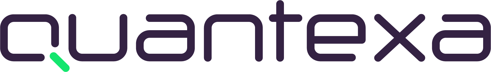

<h1 align="center">Hey There :v:</h1>
<h2 align="center">I'm Oliver Cadman, a Junior Full-Stack Developer.</h2>

I'm passionate to build upon my skillset with each day, and to be creative with code!

 

  </img>
   
  <h3>Currently working with Xander Talent as a Software Engineering Consultant.</h3>

 

- :open_book: Recently graduated with Distinction from the **Code Institute**, with a Diploma in Software Development.

- :raising_hand_man: I'm a fervent empath, so please, ask me anything! I'm always keen to collaborate and learn to get a deeper understanding.

- :art: Though I enjoy working on both the front and back end, I love creating generative art with code. There's a little taste of some motion graphics below.

 
 

https://user-images.githubusercontent.com/79907183/203523889-2863f50c-1f91-4700-95a8-0e3cd5f1504e.mp4

 
 

You can reach me at **o.cadman@live.co.uk**

# Let's do something!

<a href="https://www.linkedin.com/in/oliver-cadman-23663b36/">Connect with me on LinkedIn</a>

[Check out my Codewars Stats](https://www.codewars.com/users/bella_pointa/stats)

## Languages and Tools I'm Using

&nbsp;&nbsp;&nbsp;&nbsp;<a href="https://flask.palletsprojects.com/en/2.1.x/" target="_blank">&nbsp;&nbsp;&nbsp;&nbsp;&nbsp;&nbsp;&nbsp;&nbsp;&nbsp;

## Some Handy Little Metrics

### Commits

### Languages

